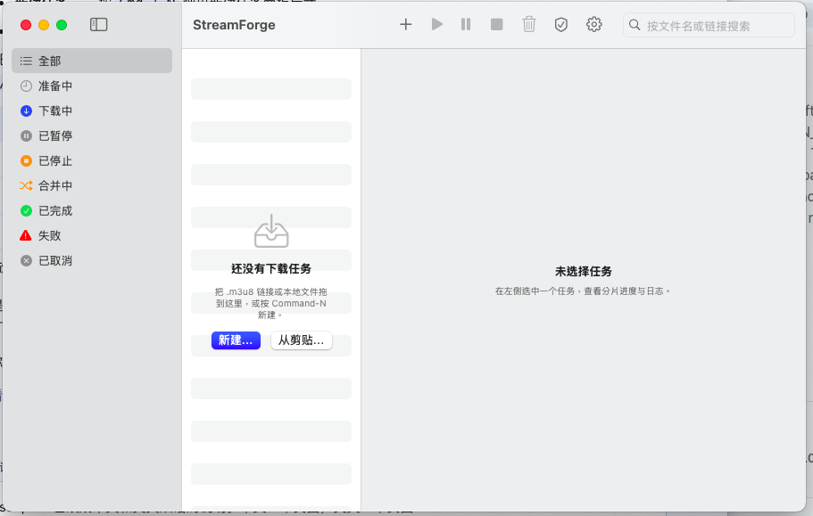
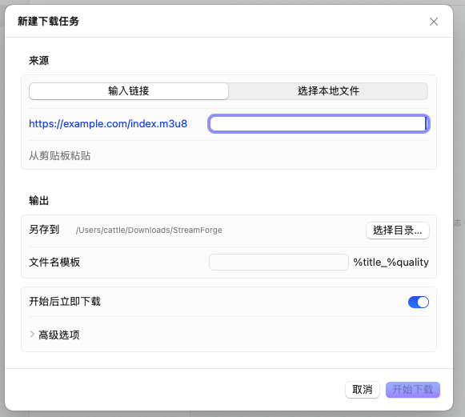
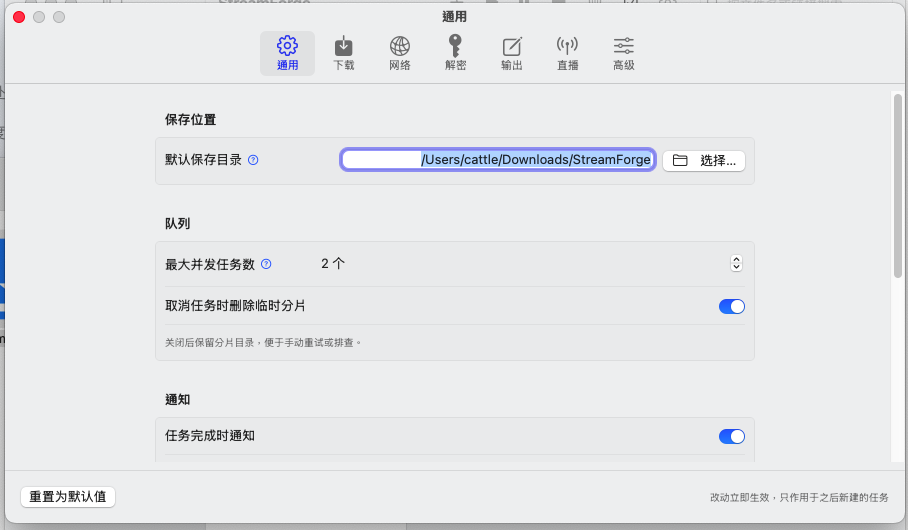

# StreamForge

[简体中文](README.md) | **English**

StreamForge is a native macOS graphical client for [N_m3u8DL-RE](https://github.com/nilaoda/N_m3u8DL-RE).

N_m3u8DL-RE is a powerful command-line streaming downloader that supports VOD and live downloads of MPD / M3U8 / ISM. StreamForge does not change any of its download behavior — it simply puts its capabilities into a window that follows macOS design conventions: tasks can queue, progress is visible, errors are actionable, and you never have to memorize command-line flags.

> **Important**: StreamForge does **not** bundle, embed, or redistribute any binaries of N_m3u8DL-RE or ffmpeg. It invokes the downloader already installed on your machine from the command line and reads its output in real time. See [NOTICE.md](NOTICE.md) for third-party attribution and licenses.

---

## Features

**Task management**
- New task: paste a URL directly, or choose a local `.m3u8` / `.mpd` / `.ism` file
- Drag & drop: drop files or URL text onto the window (or the Dock icon) to create a task
- Task queue: configurable concurrency limit (default 2); tasks beyond the limit wait in the queue
- Task control: pause / resume / cancel, plus retry after a failure

**Progress & logs**
- Live progress: completion percentage, download speed, ETA, and per-segment status
- Per-track progress: video, audio and subtitle tracks are shown independently
- Log panel: real-time downloader output, color-coded by level, with filtering, copy and clear

**Advanced settings** (six groups covering the main downloader options)
- Download: threads, retries, timeout, speed limit, concurrent downloads
- Network: system proxy / custom proxy, custom headers, cookies, BaseURL
- Decryption: decryption keys, key files, decryption engine and binary path, custom HLS key / IV
- Output: file name, naming template (`<SaveName>` `<Resolution>` `<Bandwidth>` etc.), muxing container and muxer
- Live: recording duration limit, real-time merge, pipe muxing, refresh interval and other live options
- Advanced: HLS encryption method, URL processor options, UI language, etc.

**Other**
- Automatic dependency detection: checks for the downloader and ffmpeg at launch and gives concrete installation guidance when they are missing
- System notification when a download finishes (success / failure)
- Dark mode support (follow the system or set it manually)
- Command preview: see the exact command that will be executed

---

## Requirements

- macOS 13.0 or later
- N_m3u8DL-RE and ffmpeg installed on your machine (see the next section)

---

## Dependencies

StreamForge is a graphical shell; the actual downloading is done by the following external tools, which you need to install yourself.

### Required

**1. N_m3u8DL-RE** (download core)

Download the macOS build from the upstream [Releases page](https://github.com/nilaoda/N_m3u8DL-RE/releases) (pick the one matching your chip: `osx-x64` for Intel, `osx-arm64` for Apple Silicon), unzip it and put it somewhere suitable, for example:

```bash
# example: put it in a local binary directory and make it executable
mv N_m3u8DL-RE /usr/local/bin/
chmod +x /usr/local/bin/N_m3u8DL-RE
```

macOS marks downloaded binaries with a quarantine attribute, which makes Gatekeeper block the first run. If that happens:

```bash
xattr -d com.apple.quarantine /usr/local/bin/N_m3u8DL-RE
```

**2. ffmpeg** (used for segment merging and muxing)

```bash
brew install ffmpeg
```

### Optional

Only needed when you select the corresponding decryption engine in the "Decryption" settings:

- **mp4decrypt** (part of Bento4): `brew install bento4`, the default decryption engine
- **shaka-packager**: an alternative decryption engine

The app automatically detects these tools in common paths at launch. If all of them are missing, the UI shows a dependency status card with the matching install commands, and tasks will not start until dependencies are ready.

---

## Installation

### Option 1: prebuilt artifact (recommended)

1. Download `StreamForge-<version>.dmg` from the [Releases](../../releases) page
2. Open the dmg and drag `StreamForge.app` into the "Applications" folder
3. First launch:
   - The released builds are **not signed with an Apple Developer ID**, so macOS Gatekeeper will block them
   - Fix: **right-click** `StreamForge.app` → choose "Open" → confirm in the dialog
   - (or click "Open Anyway" in "System Settings → Privacy & Security")
4. Make sure the dependencies are installed (see the previous section), then create your first task

### Option 2: build from source

```bash
git clone <your-repo-url>
cd StreamForge

# 1) run tests (an available macOS SDK is detected automatically)
./Scripts/test.sh

# 2) build the .app and package the dmg
./Scripts/build.sh
./Scripts/package.sh

# 3) open it
open dist/StreamForge.app
```

The build scripts automatically detect an available macOS SDK (trying 15.5 / 15.4 / 15.2 / 14.5 in order); no manual configuration is needed.

---

## Usage

1. Click "New Task" in the toolbar (or press `Cmd-N`)
2. Enter the stream URL, or choose a local `.m3u8` / `.mpd` file
3. Choose the save directory, and optionally set the file name or naming template
4. To adjust threads, proxy, decryption key and other options, open "Settings" (`Cmd-,`) and edit them in the matching group
5. Click Start; the task enters the queue. Track progress and live logs for the task on the right side of the main window
6. You can pause, resume or cancel at any time while downloading; a system notification appears when it finishes

---

## Scripts

| Script | Purpose |
|---|---|
| `Scripts/find-sdk.sh` | Detect an available macOS SDK (with a real SwiftUI compile probe and caching) |
| `Scripts/test.sh` | Compile and run the tests; exit code is the result |
| `Scripts/build.sh` | Compile the sources and assemble `StreamForge.app` |
| `Scripts/package.sh` | Package into a dmg (optional signing supported) |
| `Scripts/make-icon.swift` | Generate the app icon |
| `Scripts/check-layout.sh` | Architecture gate: per-file line count, dependency direction, no emoji icons |

---

## Screenshots

Main window (task list and detail, two columns):



New task panel:



Advanced settings:



---

## License

This project is licensed under the **MIT License**, see [LICENSE](LICENSE).

N_m3u8DL-RE is developed by nilaoda and is also MIT-licensed. StreamForge does not distribute its binaries. See [NOTICE.md](NOTICE.md) for third-party attribution and license notices.

Upstream notice: this software is intended for learning and technical research only. Users are responsible for complying with the laws and regulations of their country or region and should only download content they are legally entitled to access.
